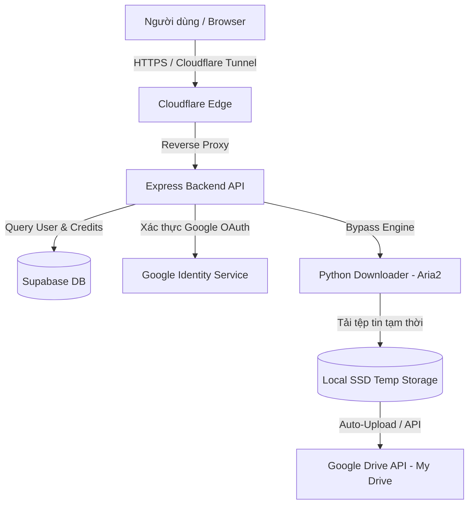

# GDrive Ultra - Google Drive Bypass & Auto Synchronizer (Frontend Showcase)

GDrive Ultra là một hệ thống cao cấp hỗ trợ vượt giới hạn tải xuống (bypass) các tệp tin/thư mục Google Drive bị khóa hoặc giới hạn truy cập, tích hợp khả năng đồng bộ đám mây tự động (Auto-Upload) về Google Drive cá nhân của người dùng và nạp hạn mức (Credits) tự động thông qua cổng thanh toán QR.

> 🔒 **Lưu ý về Bảo mật mã nguồn**:
> Để bảo vệ dữ liệu thương mại và ngăn chặn lạm dụng các API bypass, mã nguồn của phần **Core Backend API** được lưu trữ trong một repository riêng tư. Dự án này công khai mã nguồn phần **Frontend** nhằm mục đích trưng bày năng lực lập trình và kiến trúc hệ thống với các nhà tuyển dụng.

---

## 🚀 Tính Năng Nổi Bật

- **Bypass giới hạn tải xuống**: Vượt giới hạn tải và xem của các file Google Drive bị khóa, bị chặn tải xuống hoặc giới hạn số lượng truy cập trong ngày.
- **Đồng bộ đám mây tự động (Auto-Upload)**: Tải trực tiếp tệp đã bypass về Google Drive cá nhân của người dùng thông qua tích hợp Google Drive API mà không tiêu tốn tài nguyên đĩa cứng cục bộ.
- **Xác thực và phân quyền bắt buộc**: Yêu cầu người dùng liên kết tài khoản Google Drive khớp 100% với tài khoản đăng nhập để ngăn chặn việc mượn/chia sẻ tài khoản trái phép.
- **Nạp Credit tự động**: Tích hợp cổng thanh toán SePay quét mã QR nhận diện giao dịch tự động trong 1-3 phút để cộng dồn lượt tải (Credits).
- **Hệ thống Nhật ký (Activity Logs)**: Ghi lại chi tiết tiến trình tải về, tải lên Drive, và các lỗi phát sinh theo thời gian thực.

---

## 🎥 Video Demo & Ảnh Chụp Giao Diện

### Video chạy thực tế
👉 [Xem Video Demo Hệ Thống Trên Youtube/Loom](LINK_VIDEO_CỦA_BẠN)

### Ảnh chụp màn hình Dashboard

---

## 🛠️ Công Nghệ Sử Dụng

### Frontend
- **Framework**: Next.js 16 (App Router, Turbopack)
- **Styling**: Vanilla CSS, TailwindCSS (for custom modules)
- **Animations**: Framer Motion (Segmented control tab, smooth slide transitions)
- **Icons**: Lucide React

### Backend (Mã nguồn riêng tư)
- **Runtime**: Node.js & TypeScript
- **Framework**: Express.js
- **Database**: PostgreSQL (Supabase Auth & Database client)
- **Worker**: Python 3 (Bypass scripts, Aria2 multi-threaded downloader, Google Drive API clients)
- **Tunneling**: Cloudflare Tunnel (Bypass NAT/Firewall để truy xuất local server an toàn)
- **Containerization**: Docker & Docker Compose (Quản lý môi trường độc lập)

---

## 📐 Kiến Trúc Hệ Thống (System Architecture)

---

## 🔒 Các Giải Giải Pháp Bảo Mật Đã Triển Khai

1. **Chống dò quét thư mục (Directory Traversal Protection)**: Kiểm tra và lọc tất cả các tham số ID tải xuống bằng Regex UUID, loại bỏ hoàn toàn nguy cơ rò rỉ file hệ thống thông qua các payload dạng `../`.
2. **Xác thực Webhook an toàn**: Xác thực API Key (`SEPAY_API_KEY`) trên header của mọi yêu cầu từ cổng thanh toán SePay trước khi duyệt cộng credit.
3. **Chống lạm dụng tài khoản**: So khớp case-insensitive email tài khoản đăng nhập với email Google Drive được liên kết thông qua OAuth callback để ngăn ngừa việc dùng chung tài khoản Drive hoặc chia sẻ API bất hợp pháp.
