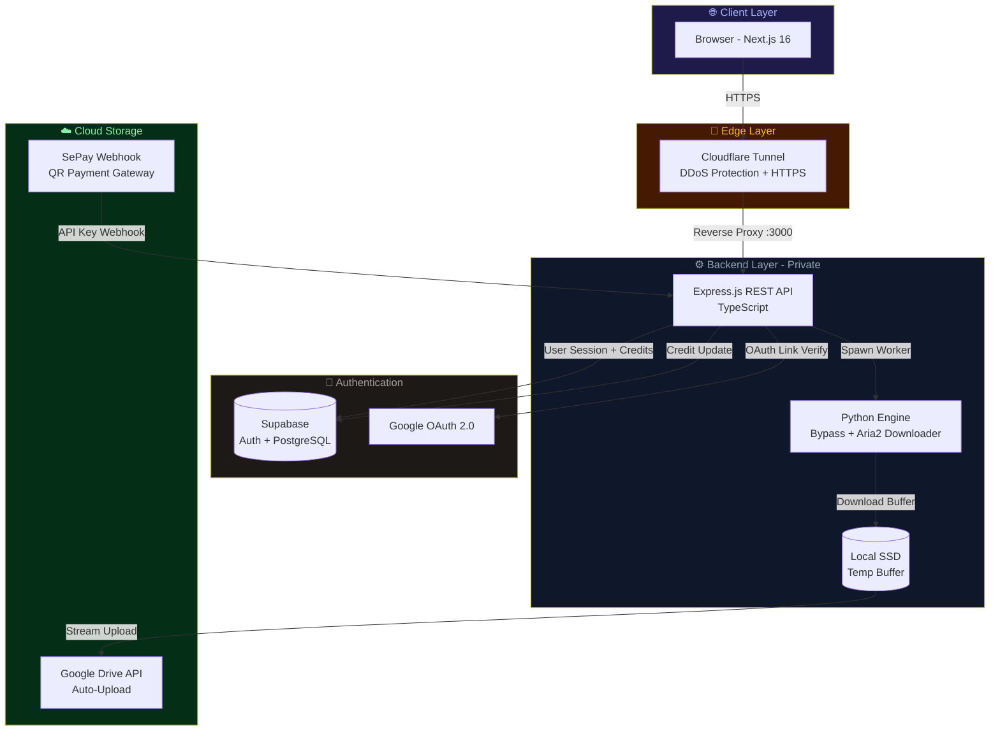

<div align="center">


<br/><br/>


<br/>

# 🚀 GDrive Ultra

### _Hệ thống Bypass & Đồng bộ Google Drive toàn diện_

**Nền tảng SaaS thương mại giúp vượt giới hạn tải xuống Google Drive, tự động đồng bộ đám mây và quản lý lượt tải thông minh theo thời gian thực.**

<br/>

[🌐 Xem website](https://though-definitely-seem-log.trycloudflare.com) &nbsp;·&nbsp; [📋 Tài liệu Kỹ thuật](#-kiến-trúc-hệ-thống) &nbsp;·&nbsp; [🔒 Giải pháp Bảo mật](#-bảo-mật--security)

<br/>

</div>

---

## 📌 Giới thiệu

> **🔐 Lưu ý về bảo mật mã nguồn:** Đây là dự án thương mại cá nhân đang vận hành và có doanh thu. Để bảo vệ thuật toán bypass và API nội bộ, phần **Core Backend** (Node.js/Python engine) được lưu trong **private repository** riêng biệt. Repository này chứa toàn bộ mã nguồn **Frontend** công khai để nhà tuyển dụng đánh giá năng lực kỹ thuật.

**GDrive Ultra** giải quyết một vấn đề thực tế: Google Drive giới hạn quyền tải xuống các tệp học tập, tài liệu nghiên cứu chia sẻ công cộng khi vượt quá số lượt truy cập nhất định — khiến người dùng không thể tải dù file được chia sẻ công khai.

Hệ thống tích hợp engine Python xử lý bypass đa luồng, xác thực OAuth2 an toàn, cổng thanh toán tự động và đồng bộ đám mây thời gian thực.

---

## ✨ Tính Năng Chính

<table>
<tr>
<td width="50%">

### ⚡ Bypass Engine
Vượt qua giới hạn tải xuống Google Drive bị khóa bằng engine Python đa luồng kết hợp Aria2c, hỗ trợ cả file đơn lẻ và toàn bộ thư mục.

</td>
<td width="50%">

### ☁️ Auto-Upload Đám Mây
Sau khi bypass, tệp được chuyển tiếp **trực tiếp** lên Google Drive cá nhân của người dùng — không chiếm tài nguyên ổ cứng cục bộ.

</td>
</tr>
<tr>
<td>

### 💳 Thanh Toán Tự Động
Tích hợp cổng SePay quét mã QR. Hệ thống webhook tự động nhận diện giao dịch và kích hoạt Credits trong **1-3 phút**.

</td>
<td>

### 🔐 Bảo Mật Đa Lớp
Xác thực OAuth2 Google bắt buộc khớp email đăng nhập, chống Directory Traversal, và API Key Webhook để ngăn giả mạo thanh toán.

</td>
</tr>
<tr>
<td>

### 📊 Activity Log Thời Gian Thực
Nhật ký hoạt động với bộ lọc theo loại (Tải về / Tải lên Drive / Lỗi) và trạng thái tiến trình chi tiết từng tệp.

</td>
<td>

### 👑 Gói VIP Linh Hoạt
Hệ thống phân cấp Credits với gói VIP Tuần / VIP Tháng / VIP Vĩnh Viễn, đồng bộ trạng thái theo thời gian thực trên mọi thiết bị.

</td>
</tr>
</table>

---

## 🖼️ Giao Diện

<table>
<tr>
<td align="center" width="50%">

**Dashboard — Tab Tải File**


</td>
<td align="center" width="50%">

**Hướng Dẫn Sử Dụng A-Z**


</td>
</tr>
</table>

---

## 📐 Kiến Trúc Hệ Thống



---

## 🛠️ Công Nghệ Sử Dụng

### Frontend _(Repository này)_

| Công nghệ | Phiên bản | Mục đích |
|---|---|---|
|  | 16 (Turbopack) | App Router, SSG, API Routes |
|  | 5.x | Type-safe toàn bộ codebase |
|  | 11 | Segmented tabs, transition animations |
|  | Latest | Icon system |
|  | 2.x | Auth client, session management |

### Backend _(Private Repository)_

| Công nghệ | Mục đích |
|---|---|
|  **Express.js + TypeScript** | REST API server |
|  **+ Aria2c** | Bypass engine, đa luồng downloader |
|  **PostgreSQL** | User data, credits, session store |
|  | Auto-upload tệp đã bypass |
|  | Public HTTPS endpoint không cần server public IP |
|  | Môi trường container hóa độc lập |

---

## 🔒 Bảo Mật & Security

Các lỗ hổng bảo mật tiêu biểu đã được phát hiện và xử lý trong dự án:

| # | Lỗ hổng | Giải pháp |
|---|---|---|
| 1 | **Directory Traversal** — Payload `../etc/passwd` qua download ID | Strict UUID Regex validation trước khi đọc filesystem |
| 2 | **Unauthenticated Admin Endpoint** — `/api/system/shutdown` không có auth | Xóa route, thay bằng tắt qua Docker CLI |
| 3 | **Webhook Spoofing** — Giả mạo thanh toán SePay | Header API Key (`SEPAY_API_KEY`) validation bắt buộc |
| 4 | **Drive Account Sharing Abuse** — Dùng Drive người khác để tải | Email OAuth2 callback so khớp case-insensitive với email đăng nhập |
| 5 | **Static File Exposure** — `/temp` mount public | Xóa static mount, chỉ phục vụ qua authenticated download route |

---

## 📂 Cấu Trúc Frontend

```
frontend-web/
├── src/
│   ├── app/
│   │   ├── dashboard/
│   │   │   ├── page.tsx          # Dashboard chính — tabs, form, log sidebar
│   │   │   └── GuideMockups.tsx  # CSS animated mockup simulators (A-Z guide)
│   │   ├── login/
│   │   │   └── page.tsx          # Trang đăng nhập Supabase Auth
│   │   ├── admin/
│   │   │   └── page.tsx          # Trang quản trị (protected route)
│   │   ├── globals.css           # Design system tokens, custom utilities
│   │   └── layout.tsx            # Root layout, font, metadata
│   └── lib/
│       └── supabaseClient.ts     # Supabase browser client singleton
├── public/
│   └── screenshots/              # Ảnh minh họa UI
└── next.config.ts                # Next.js rewrites, env validation
```

---

## 🚀 Chạy Local (Development)

```bash
# Clone frontend repo
git clone https://github.com/vanphu1201/gdrive-ultra-frontend.git
cd gdrive-ultra-frontend

# Cài dependencies
npm install

# Tạo file môi trường
cp .env.example .env.local
# Điền NEXT_PUBLIC_SUPABASE_URL và NEXT_PUBLIC_SUPABASE_ANON_KEY

# Chạy dev server
npm run dev
# → http://localhost:3000
```

> **Lưu ý**: Để sử dụng đầy đủ tính năng (bypass, download, upload Drive), cần chạy kết hợp với Backend API (private repository). Frontend hoạt động độc lập cho mục đích xem giao diện và xác thực người dùng.

---

## 📬 Liên Hệ

<div align="center">

Dự án được xây dựng và vận hành bởi **Van Phu**

[](https://github.com/vanphu1201)
[](mailto:phu0348880746@gmail.com)

<br/>

_Nhà tuyển dụng muốn xem chi tiết mã nguồn Backend (Node.js/Python/Docker), vui lòng liên hệ qua email để được cấp quyền truy cập repository riêng tư._

</div>

---

<div align="center">
<sub>© 2025 GDrive Ultra · Built with ❤️ in Vietnam</sub>
</div>
